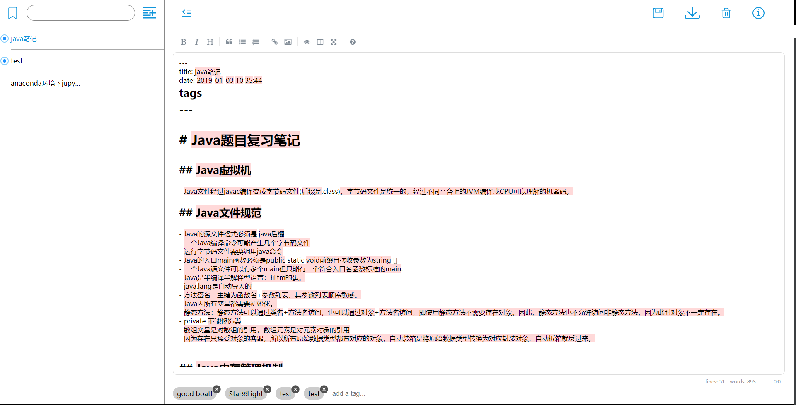
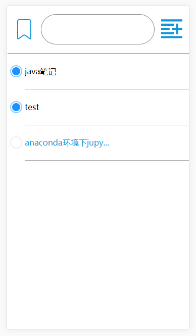
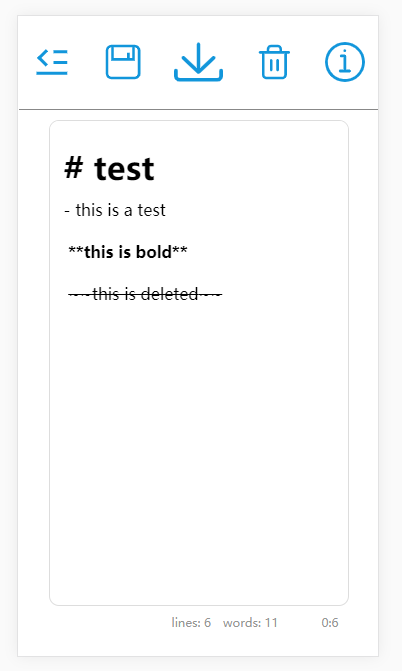

# simpleNote

这是一个基于create-react-app脚手架的在线笔记，预计可以实现从前端到后台完整的功能，页面设计参考[Simplenote](https://simplenote.com/)。

具体效果可以参考这个[demo](http://118.126.64.186:3001/)

## 项目大概结构|structure

### 布局
- less
- css
  在create-react-app的基础上，因为之前less的经验，我使用了less+idea插件fileWatcher来作为技术栈。fileWatcher监视index.less的变动，然后实时编译为css文件，相比之下如果直接编写css的话create-react-app还要先save才能看到改动，这个操作节约了不少时间。

###  数据管理

- redux

  我在这次项目中没有用redux+react-redux的配合，原因很简单，太琐碎了，对于一个复建项目来讲，在不知道为什么要用这么复杂的结构之前直接使用这套技术栈未必是件好事。于是我只是用了redux必须的actions和reducers。 使用redux的目的无非是建立一个前端的数据库，让每个组件都可以拿到全局变量来决定自己的状态。好在这个应用的组件树并不是非常深，于是我把store在app.js，即整个程序的入口处声明，然后把store作为每个子组件的props给传下去，用这样的方法来替代react-redux。下一个项目如果可以的话我想用react-redux，到时候再反思一下这么做的好处和缺点在哪里。

  （听说mobx的结构也不错，有空打算试一试。）

### 后台通信/后台数据结构

- axios

  一开始想用fetch，然后发现这个api问题比较大，至今不知如何解决它的跨域问题，**由此觉得需要补一些通信方面的常识**。后面被人推荐了axios，用了一下感觉很舒服，就决定用这个库了。

- nodejs

  所有和后台通信的函数都放在communication method里面，后台使用了简单的express框架，加的中间件只有一个body-praser，笔记列表和各种附带信息（是否置顶，字数等）用json格式存储，md本体使用md格式存储。

### markdown编辑器

- SimpleMDE

  这也是我觉得这个项目最尴尬（拿不出手）的地方：作为一个笔记软件，最核心的部件编辑器使用的是别人的开源项目。虽然说大家都是一样的抄，不过还是觉得不是非常好意思。

  这个编辑器在电脑端上表现相比而言比较正常，不过在手机端下的表现就不如人意了，会出现第一个浏览的markdown文件在点击之前加载不出来的情况，这个bug到目前为止没有找到原因（懒）

### 移动端支持

- window.matchMedia

  移动端是比较尴尬的部分，因为simpleNote对于移动端的设计也是按照“在电脑上的移动端”来设计的，无奈之下只好通过增大图标+减少功能来实现移动端支持，效果一般。 **对于移动端如何设计界面这回事，我得花点心思了。**.


## 细节笔记|implement details
### 只用CSS实现将单个元素置于底层
```css
containerEle:before { //用伪元素+flex-box的order属性来填充
                content: '';
                display: flex;
                flex-grow: 1;
                order: 3;
            }
```
- 使用伪元素+flex-grow(膨胀占据不用的空间)+order(伪元素自动排最后或者最前，故需要order来重新排序，达到让某个元素被挤到最后的效果)

## 感想|reconsideration

### react组件化的想法

这个项目算是我第一个react的项目，其中接触到的react组件化也十分惊艳，比较喜欢把web项目分割成组件的想法，感觉这样很好的解决了web耦合性严重 相比之下，之前用过的angularJS就感觉不咋样了，不过typescript想必也会有很好的新特性吧233

### 代码耦合问题

尽管有react的组件化特性做支撑，但是考虑到时间因素还是不可避免的对代码的整洁性做了一定妥协。 比如说在前端将文章置顶以后要将文章发到后台同步，然后为了前后端数据的一致性又得在同步以后将数据回传然后再前端更新，那只能从app中将store引入，然后写在一个叫做updater的js文件里，再在communication method 中引入updater进行操作（但是还是存在耦合了）还是看一下react-redux里有没有比较优雅的实现这种post后更新的操作吧

## 预览|preview




<center>PC端主界面</center>



<center>移动端目录界面</center>



<center>移动端笔记界面</center>

## 总结

- 网络传输部分需要更加系统的知识
- 需要更加透彻的调试工具和手段
- 需要更加规范的使用react-redux的手法
- 需要补习移动端web界面设计的知识